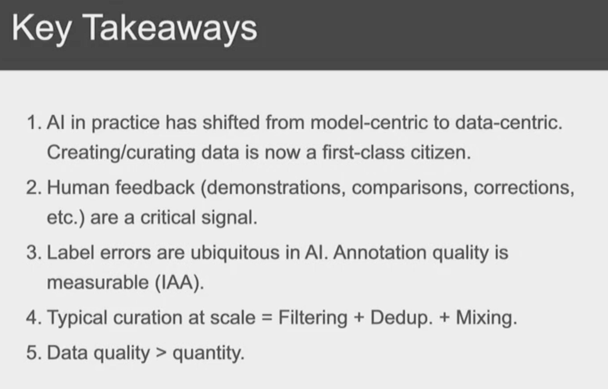
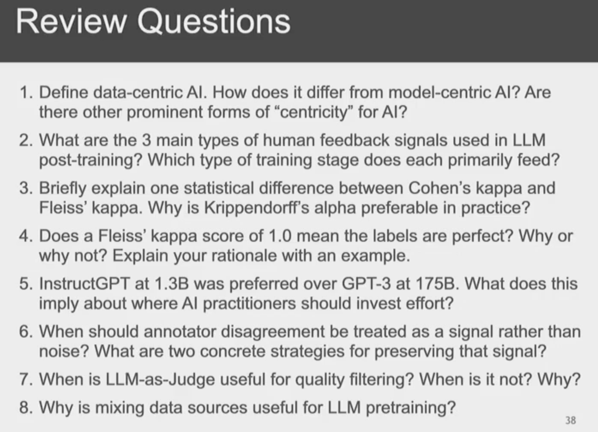
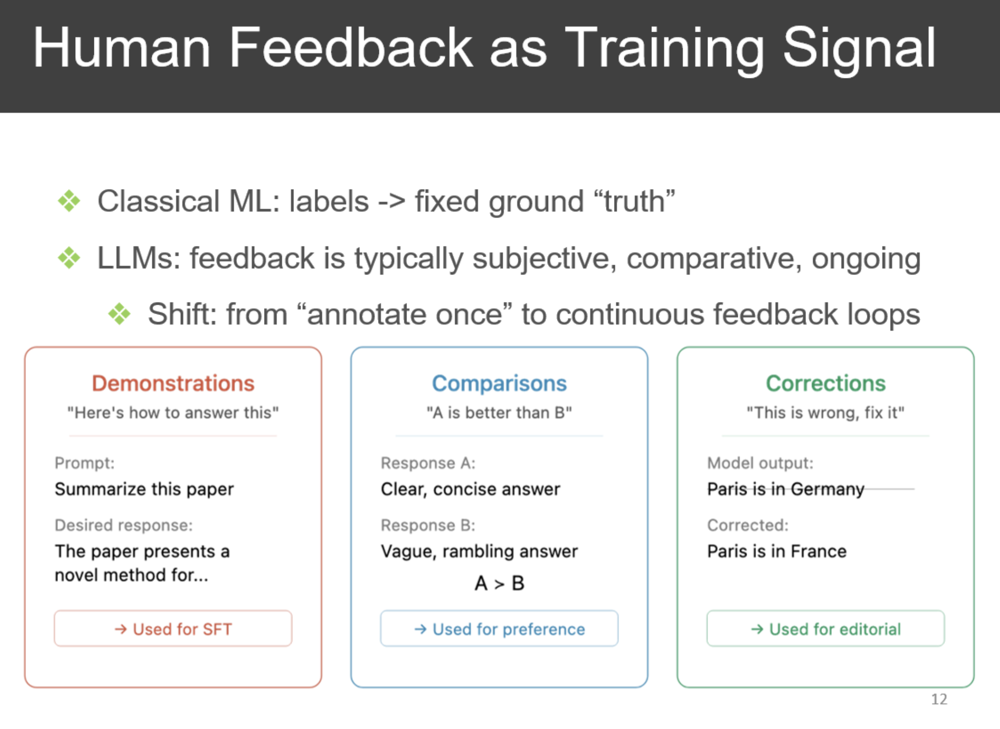
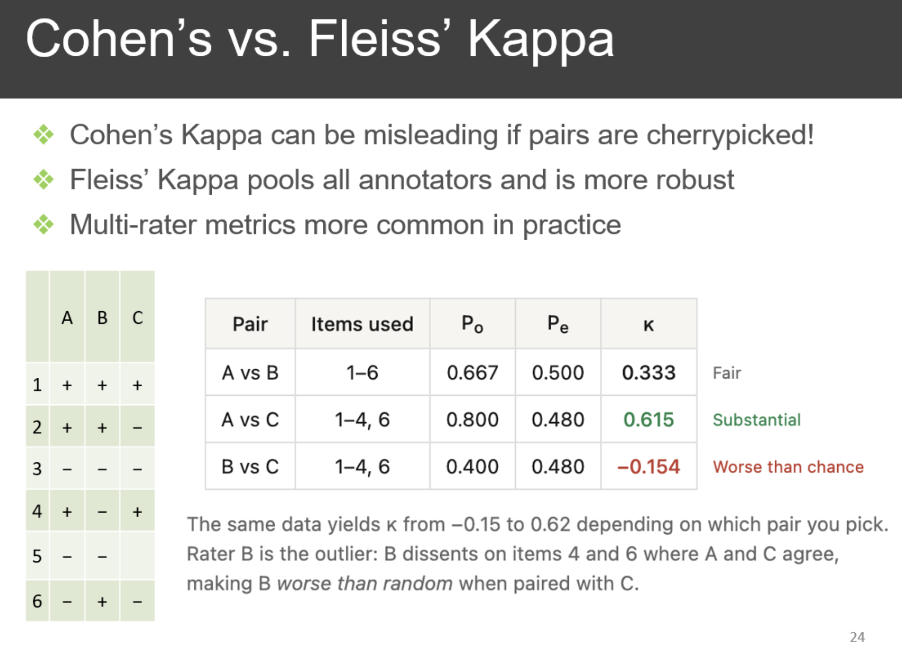
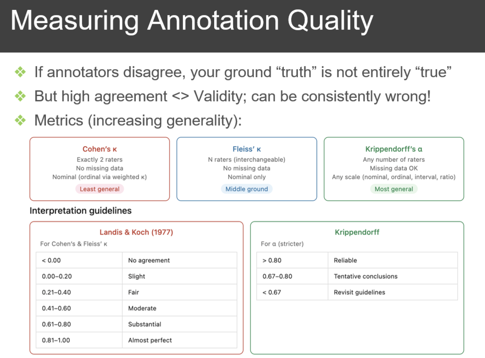

# takeaways

# Review questions

0. Data modality include: Tabular, Time Series, Text Image Audio, Video....

1. Now the industry are shifting from Model-centric to Data-centric since we know that data quality is important for model quality. And there are also Human-centric, compute-centric, system-centric...

2. Three main types of human feedback in LLm post-training: 

 - Demonstration(Supervised Fine-Tuning, SFT): used in supervised fine tuning, by providing solid example to format the model's output to be more human perferralable; Human annotators provide high-quality input–output examples to guide the model toward preferred behavior. 
   - **Goal**: Teach the model what a good response looks like. 
   - **Example**: Writing helpful, safe, and well-structured answers. 
   - **Strength**: Strong control over output format and style
   - **Limitation**: Expensive and limited in coverage
 - Comparison(Preference Learning / Alignment): Annotators compare multiple model outputs and select the better one. Used in Preference alignmnet, particularly for model used in enterpriced field, they should behave differently. 
   - **Goal**: Train a preference model (reward model) that captures human judgments
   - **Commonly used in**: RLHF pipelines
   - **Strength**: Easier and more scalable than writing full demonstrations
   - **Limitation**: Provides relative signals (A > B), not absolute correctness
 - Rating/Error Correction(Reinforcement & Iterative Feedback): in post-training. Humans provide scores, corrections, or feedback on model outputs. 
   - **Goal**: Improve model behavior through iterative refinement
   - **Examples**: Assigning quality scores (ratings) Fixing incorrect answers (error correction)
   - **Used in**: Reinforcement learning, online feedback loops
   - **Strength**: Enables continuous improvement and fine-grained control
   - **Limitation**: Can be noisy and inconsistent across annotators
 - Demonstration = high quality but expensive
 - Comparison = scalable but less precise
 - Rating = flexible but noisy

3. Difference between Cohen's kappa and Fleiss's kappa. Why krippendorff's alpha preferable in practice:
 - Cohen's kappa only compares 2 annotators, while Fleiss's kappa compares more then 2 annotators
    
 - Krippendorff's alpha preferable in practice, since it can deal with the missing data, it can deal with different type of data modality scale: norminal, ordinal, ratio...
    
4. Fleiss's kappa score of 1.0 could means there is a probability non-zero that all annotations are wrong.
5. Now AI practitioners should invest more on the qulity of the data, refine and iterate on the data
6. Annotator disaggrement is also a valid. Since polarization of annotations itself is signal and social scientists polutical scientists study this. For things like how disinformation and flame wars speard in social media, so diusagreement does not necessarily mean noice, could be signal. The model. Solution to the annotator disagreement: 
    - preserve the statistical count of the disagreements on annotation.
    - incorporate that into the learning
    - The model learns not from a single lable, but from a probability distribution over the lable vocabulary.
7. When LLM as judge usedful: when rules are hard to concretely specify. They might become too rigid. LLM can help with different filtering and more nuance. Also, human annotation can be too expensive. When is it not: when there are compute bound.
8. Why mixing data source: LLM need wider set of applications represented . You wnt to have it's performance validated on different sources of data to improve generalizmbility.

# Concepts
1. in-depth training: deeper exploration to the topic: add constrain, deepen reasoning make complicated input.
2. in-breath training: using new instructions to raise the diversity
3. Synthetic Data: used since human annotation is expensive, but they are heavey on the classification tasks, not on the side of reasoning, which means the question-answer pair could be too simple.

# 1. Why Synthetic Data in LLM training?
#### 1. Data scarcity (high-quality data is limited)
Even though the internet is huge, high-quality, diverse, and clean data is surprisingly limited.
 - LLMs need trillions of tokens
 - Much web data is noisy, duplicated, or low-value
 - Some domains (e.g., legal, medical, rare languages) have very little accessible data

👉 Synthetic data helps fill gaps by generating targeted, high-quality examples.

#### 2. Control over data distribution
With real data, you can’t easily control:
 - Topic balance
 - Difficulty level
 - Style (formal, conversational, etc.)

With synthetic data, you can:
 - Generate hard reasoning problems
 - Balance underrepresented categories
 - Create curriculum-style training (easy → hard)

👉 This is especially useful for improving reasoning and alignment.

#### 3. Alignment & instruction tuning
Synthetic data is heavily used in:
1. Instruction-following datasets
2. RLHF / post-training pipelines

Example:
 - Humans or models generate prompts
 - Stronger models generate high-quality responses

This creates datasets like:

“User asks X → ideal assistant answer Y”

👉 Helps models behave more like helpful assistants rather than just text predictors.

#### 4. Privacy and safety
Real-world data often includes:
 - Personal information
 - Copyrighted material
 - Sensitive content

Synthetic data:

Can be generated without exposing real users
Avoids legal/privacy risks

👉 Important for enterprise and regulated domains.

#### 5. Data augmentation (boosting performance)
Synthetic data can expand existing datasets:
 - Paraphrasing
 - Adding edge cases
 - Generating adversarial examples

Example:
 - Turn 1 math problem into 20 variations
 - Create tricky corner cases for robustness

👉 Leads to better generalization and robustness.

#### 6. Bootstrapping with stronger models (self-improvement)
A powerful idea:
 - Use a strong model (e.g., GPT-4-level)
 - Generate training data for a smaller or newer model

This is sometimes called:
 - distillation
 - self-training
 - model bootstrapping

👉 Lets smaller models “inherit” capabilities from stronger ones at lower cost.

### Trade-offs (important)

Synthetic data isn’t perfect:

❌ Can introduce model biases or errors
❌ Risk of “model collapse” (training on its own outputs repeatedly)
❌ May reduce diversity if overused

👉 Best practice: **mix synthetic + real data carefully**

Think of synthetic data as: **“A way to manufacture exactly the training examples you wish you had.”**