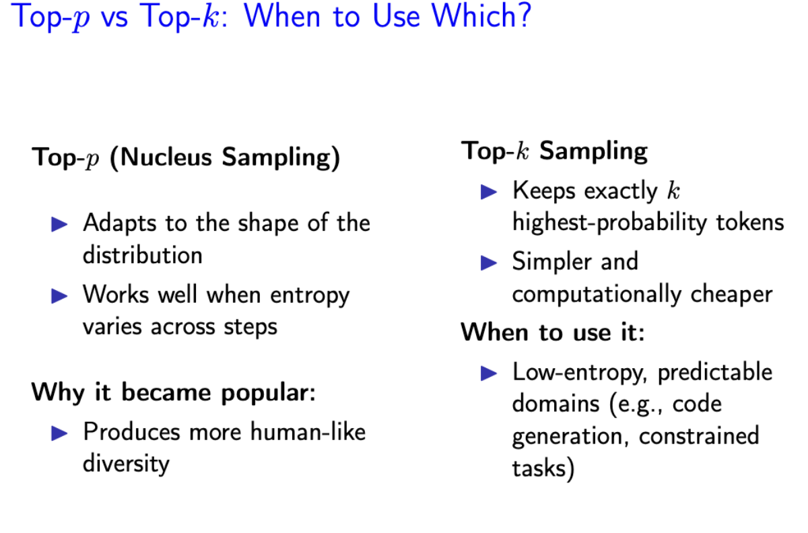
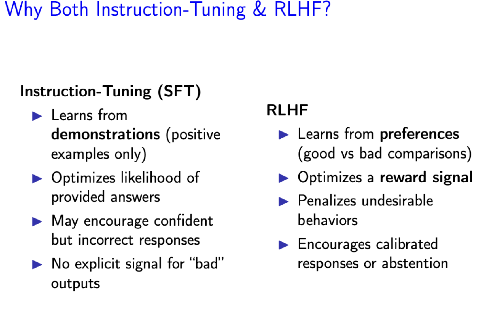

# Model type
 - Skip-gram Model: we predict the surrounding context words given the current center word. Used in Word2Vec, skip-gram models predict surrounding words given a target word. They are effective for capturing semantic relationships between words.
 - N-gram Model: Predicting the center word from context is called CBOW (Continuous Bag of Words).
 - DAN - FNN model
 - Neural networks based language models: RNN / LSTM / GRUs / seq2seq
 - BERT: Encoder-only, uses bidirectional context, great for sentence classification. (with their ability to remember long-range dependencies, are well-suited for machine translation applications, where context and sequence memory are crucial.)
 - GPT: Decoder-only, uses causal (left-to-right) context, used for generation
 - seq2seq: Encoder-Decoder, neural network architecture designed to transform one sequence into another. It is widely used in tasks such as machine translation, text summarization, speech recognition, and image captioning.

 ### DAN 
 DAN stands for Deep Averaging Network. It takes all the word embeddings in a sentence, adds them up, and divides by the number of words **(averaging)**. Because addition is commutative ($A + B = B + A$), a DAN completely destroys word order. "Dog bites man" and "Man bites dog" have the exact same representation in a DAN
  - A) Core Math: You mentioned the FFNN and ReLU, but you missed the most important first step: Averaging. The core mathematical operation is taking the element-wise mean of all the word embeddings in the input sequence before passing it to the FFNN.
  - B) Failure case: Your reasoning was perfect! A specific example of this failure is negation/sentiment analysis. Because a DAN ignores word order, the sentences "The movie was not bad, it was good" and "The movie was not good, it was bad" yield the exact same average vector, causing the DAN to fail miserably compared to an RNN.

 ### RNN and LSTM
 RNN is used to solve the problem of the DAN can only process the fixed sequence length.
 
 LSTM is used to solve the problem of RNN sometimes will have vanishing gradients when there are deep layers.

 Increasing the learning rate actually often leads to exploding gradients (where weights become huge and unstable), not fixing vanishing ones. The "Vanishing Gradient" problem means the gradient signal becomes virtually zero as it travels back through long sequences, so the model "forgets" early inputs.

 Why LSTMs? LSTMs were explicitly invented to solve this. They use gating mechanisms (forget, input, and output gates) that create a "gradient superhighway," allowing error signals to flow backward through time without vanishing.

### Vanilla RNN
  A recurrent neural network that maintains a hidden state passed through time.
  - Input: current token 
  - Previous hidden state: 
  - Output: new hidden state 

  Characteristics
  - Processes sequence left → right
  - Single hidden state
  - Shares parameters across time steps

  Limitations
  - Suffers from vanishing/exploding gradients
  - Poor at modeling long-term dependencies

 ### Bidirectional RNN (BiRNN)
 Runs two RNNs in opposite directions:
  - Forward RNN: left → right
  - Backward RNN: right → left
 
 Characteristics
  - Uses both past and future context
  - Requires full sequence before processing
 
 Typical Use Cases
 - POS tagging
 - Named Entity Recognition
 - Sentence classification

 ### LSTM (Long Short-Term Memory)
 Designed to solve the vanishing gradient problem.
 Key Components:
 1. Cell state 
 2. Hidden state 
 3. Forget gate, Input gate, Output gate

 Gates

 - Forget gate: decides what to remove
 - Input gate: decides what to store
 - Output gate: decides what to expose

 Characteristics
 - Maintains long-term memory
 - More parameters than vanilla RNN
 - Handles long sequences better

Model	| Long-Term Memory | Bidirectional | Deep Layers | Sequence-to-Sequence	| Learns Word Embeddings
|--------|--------|-------|------|------|------|
| Vanilla RNN	| No	| No	| No	| No	| No| 
| BiRNN |	No	| Yes	| No	| No	| No|
| Multi-layer RNN	| No	| No	|Yes	| No	|No |
| LSTM	| Yes |	No	| Optional|	No	|No|
| GRU	|Yes | 	No	| Optional |	No|	No|
| Seq2Seq	| Yes (if LSTM/GRU)	| Optional |	Optional	| Yes	| No|
| Word2Vec	| No	| No	| No	| No	| Yes |

 ### BERT - (encoder with mask for classification task)
 
 Idea: we want different embedding for each word in each context it appears

 1. BERT is a Transformer encoder: bidirectional attention
 2. BERT is used to make a classic pattern for mordem NLP: pre-training -> fine-tune 
 3. BERT cannot generate text (at least not in an obvious way)
 4. Could put [MASK] at the end repeatedly, but this is slow and in practice lacks coherence E.g,: "The cat sat on the [MASK]" → "The cat sat on the mat"
 5. Masked language models are intended to be used primarily for "analysis" tasks (e.g., classification, question answering, etc.) rather than generation tasks
 6. each token depends on all the other token, soKV cache do not work here, since KV cache works when the current calculation only depends on the previous layer's of K and V

 ### GPT-2
 - Uses Transformer decoder-only architecture
 - Unidirectional (causal) attention (current token only have access to the previous tokens)

 Compare to BERT:
 - BERT: Pretraining + Supervised Fine-Tuning (Pretrained on large corpus (unsupervised) -> Fine-tuned on specific tasks (supervised))
 - GPT-2: Mostly Zero-shot (Originally) (Just scaling next-token prediction -> On a huge dataset -> Without task-specific fine-tuning)

 ### How Seq2Seq Works
 Seq2Seq = Encoding RNN + Decoding RNN 

 The process involves two phases:

 Encoding: The encoder processes the input sequence token by token, updating its internal state at each step. After processing the entire sequence, it outputs a context vector summarizing the input. (one vector only for the model)

 Decoding: The decoder uses the context vector to generate the output sequence token by token. During training, techniques like teacher forcing are used, where the actual target token is provided as input to the decoder instead of its previous prediction.

 Optimization: Attention is a way to focus on particular parts of the input - mproves sequence-to-sequence a lot by letting each hidden layer of decoder to interact with each of the hidden layer's Similarity scores of encoder
 And it will generate a context vector
 

 ### Token Selection
 In **greedy decoding**, usually we decode until the model produces an <END> token
 - For example: <START> he hit me with a pie <END>
 
 In **beam search decoding**, different hypotheses may produce <END> tokens on different timesteps
 - When a hypothesis produces <END>, that hypothesis is complete.
 - Place it aside and continue exploring other hypotheses via beam search.
 
 Usually we continue beam search until:
 - We reach timestep T (where T is some pre-defined cutoff), or
 - We have at least n completed hypotheses (where n is pre-defined cutoff)

 And sampling we will cover later:

### top-k / top-p / Sampling 
  - How **Top-$k$** works: The model looks at the whole vocabulary, isolates the top 5 most likely words, throws away the rest of the vocabulary, and then rolls a weighted die (samples) among those 5. It doesn't pick 5 times in a row; it picks one next token randomly from that top-5 pool.
  - **Top-k**: fixed vocabulary size - A fixed k ignores distribution shape.
  - **Top-p**: fixed probability mass
  - **Sampling**: Draw tokens from the probability distribution
  


 ### QKV
 
 Q, K, V in Seq2Seq:
 - Query: The Decoder's current hidden state (What am I currently translating?). - Source sequence
 - Keys/Values: The Encoder's hidden states (What information do I have from the source sentence?). - target sequence
 
 QKV in self-attention:
 - all of them are from the current hidden statess

 
 ### Self-attention
 The attention matrix calculates a score for every query against every key, resulting in an $N \times N$ matrix
 
 Impact on Long Docs in self-attention: While "time" is a factor, the bigger killer is Memory (RAM). Because the complexity is quadratic, doubling the sequence length quadruples the memory required. Processing a whole book (e.g., 50,000 tokens) would create an attention matrix with 2.5 billion entries, likely causing the GPU to run out of memory (OOM) immediately.

 ### Scaling Laws
 Used in model training since it is expensive to pretrain a large language model (takes a lot of compute resources)
 - une on small models, extrapolate to large ones
 - scale according to compute budget: resource C = N * D (N = number of parameters = model size, D = number of training tokens = dataset size)
 1. **Chinchilla Scaling Laws Approach** - Fix FLOPs and vary model size and training tokens
 2. **IsoFlops** - Fix flops and vary model size and training tokens

 ### training and inference 
 "In-context learning" or "Prompting" means you just type examples into the text prompt. The model's internal weights ($\theta$) are completely frozen/unchanged. It "learns" temporarily just by reading your prompt in the inference phase.
 
 ### Chain-of-Thought (CoT) Prompting
 For multi-step problems, we can ask the model to generate intermediate steps before the final answer.
 
 CoT improves performance without changing model parameters.

 ### Few shot / Few shot CoT / zero shot / zero shot CoT / RF
 Prompting enables task adaptation at inference time
 1. Zero-shot Prompting: 
  - Highly sensitive to wording 
  - Prompt design can dramatically change performance 
 2. Few-shot Prompting:
 - Demonstrations reduce ambiguity
 - But performance depends on example choice and order

 CoT improves performance without changing model parameters.

 3. **Zero-Shot** Chain-of-Thought Prompting:
 - Do not need few-shot examples in Chain-of-thought Prompting
 - Simply adding a reasoning cue can improve performance: "Let's think step by step"
 4. **Self-Consistency** in Chain-of-Thought Prompting:
 - Instead of generating one chain of thought, sample multiple reasoning paths.
 - Take a majority vote over the final answers.

 InstructGPT: scaling up RLHF
 1) Instruction Fine-tuning; 
 2) Human preferences from comparison data; 
 3) Optimize a policy against a reward model using RL
 


 ### Instruction Tuning / Instruction Fine-Tuning / RLHF
 Instruction Fine-Tuning (SFT)
 - Supervised fine-tuning on (instruction, response) pairs
 - Optionally followed by preference optimization (e.g., RLHF)
 - Learns from demonstrations (positive examples only)
 - Optimizes likelihood of provided answers
 - May encourage confident but incorrect responses
 - No explicit signal for “bad” outputs
 
 Reinforcement Learning from Human Feedback (RLHF)
  - Learn a reward model from human preference comparisons
  - Optimize the language model to maximize that reward
  - Learns from preferences (good vs bad comparisons)
  - Optimizes a reward signal
  - Penalizes undesirable behaviors
  - Encourages calibrated responses or abstention

 ### Local window attention - optimization
 Here is how that property works based on the sources:
 - From Quadratic to Linear: In the standard transformer architecture, every token must calculate a weight for every other token in the sequence, resulting in O(n^2) complexity. In contrast, local window attention restricts each token to attending only to its local neighborhood within a specific window size (e.g., w=8). This reduces the computational and memory complexity to O(n×w), which is much more efficient for long sequences.
 - Sparse Masking: This is achieved through sparse masking, where all attention weights for tokens outside the window are essentially set to zero. You can see this visually in the sources; while a standard encoder's attention matrix is fully filled, the local window matrix looks like a diagonal band, showing that tokens only interact with their immediate neighbors.
 - Efficiency vs. Performance: Despite not looking at the entire sequence, this approach reached the best classification accuracy (83.20%) in your Part 3 experiments. This suggests that for speech classification, the model often only needs to capture nearby token relationships and local linguistic patterns to identify the speaker effectively

 ### Encoder-decoder model
  | Feature             | BART                  | T5                  | GPT-2        | GPT-3                                           |
  | ------------------- | --------------------- | ------------------- |--------------|-------------------------------------------------|
  | Structure           | Encoder–Decoder       | Encoder–Decoder     | decoder-only |in-context learning (prompting,no weights update) |
  | Positional Encoding | Absolute              | Relative            | N/A          |                                                 |
  | LayerNorm           | Post-LN               | Pre-LN              | N/A          |                                                 |
  | Pretraining         | Denoising autoencoder | Span corruption     | N/A          |                                                 |
  | Philosophy          | General seq2seq       | Strict text-to-text | gerneration  |                                                 |
  | Attention Bias      | No relative bias      | Relative bias       | N/A          |                                                 |

# Cards
| Key | Concept |
| --- | --- |
| Vanishing Gradient | Derivative of Sigmoid near 0 at extremes; weight updates stop. |
| $PP$ / Perplexity Formula | $e^{H(p,q)}$ (exponential of cross-entropy). If a model has a cross-entropy loss of $L$, the perplexity is defined as $e^L$ (or $2^L$ depending on the log base).|
| Causal Mask | Sets future token scores to $-\infty$ so $e^{-\infty} = 0$. |
| RoPE | Rotary position; rotates $Q$ and $K$ based on index; similarity decays with distance. |
| Gradient Checkpointing | Saves Memory, Costs Time (+33% compute) by re-calculating activations. |
| BPE Merging | Iteratively merges the most frequent adjacent pair of tokens. |
| Teacher Forcing | Feeding the ground-truth token as the next input during training. |
| Logit Temperature | $T < 1$ (Deterministic/Sharp), $T > 1$ (Diverse/Flat). |


# Concept table
| Module | Primary Topic | Core Concepts | Model Architectures | Training and Evaluation Methods | Mathematical Components | Source |
| --- | --- | --- | --- | --- | --- | --- |
| Modern LMs: Key Ingredients | Transformers & Self-Attention | Parallel computation, context-sensitive representations, Query/Key/Value paradigm, Multi-head attention | Transformer Encoder, Transformer Decoder, BERT, GPT | Beam Search, Greedy Decoding, Nucleus (Top-p) Sampling, Layer Normalization, Residual Connections | Scaled Dot-Product Attention, Softmax, Positional Encoding (Sine/Cosine), GeLU | [1-4] |
| Modern LMs: Key Ingredients | Pretrained Language Models | Transfer learning, bi-directional vs. unidirectional context, masked language modeling | ELMo, BERT, GPT-n, RoBERTa, ELECTRA, DeBERTa, T5 | Pre-training, Fine-tuning, Parameter-efficient fine-tuning (PEFT), Reinforcement Learning from Human Feedback (RLHF) | Masked language model objective, Causal masking, Cross-Entropy | [1, 5, 6] |
| Modern LMs: Background | Recurrent Neural Networks | Processing variable-length sequences, summarization of context in hidden states, vanishing/exploding gradients | Vanilla RNN, Bidirectional RNN, Multi-layer RNN, LSTM, GRU | Perplexity, Gradient Clipping, Backpropagation Through Time (BPTT) | tanh, Gating mechanisms (Input, Forget, Output gates), Sigmoid | [1, 2, 7] |
| Modern LMs: Background | Sequence-to-Sequence Models | Conditional language modeling, mapping one sequence to another, information bottleneck | Seq2Seq Encoder-Decoder RNN | Teacher Forcing, BLEU score evaluation | Autoregressive conditional probability | [1, 2, 8] |
| Intro to Neural NLP | Feedforward Neural Networks | Adding nonlinearity to linear models, composition of logistic regressions, model capacity | Feedforward Neural Networks (FFN), Deep Averaging Networks (DAN) | Backpropagation, Dropout, L2 Weight Decay, Learning Rate Schedules (Step, Cosine) | ReLU, Sigmoid, tanh, GeLU activation functions | [1, 6, 9] |
| Intro to Neural NLP | Word Embeddings | Distributional Semantics (words in similar contexts have similar meanings), dense vs. sparse vectors | Word2Vec (Skip-gram, CBOW), GloVe, FastText | Intrinsic Evaluation (Clustering, Analogies), Extrinsic Evaluation (Downstream tasks), Negative Sampling | Dot product similarity, L2 Regularization, Skip-gram loss function | [1, 2, 5, 10] |
| Intro to Neural NLP | Linear & Softmax Models | Categorization of text into classes, unnormalized scores to probabilities, Maximum Likelihood Estimation (MLE) | Linear Classifier, Softmax Classifier | Stochastic Gradient Descent (SGD), Minibatch Gradient Descent, Maximum Likelihood Estimation (MLE) | Softmax function, Cross-Entropy Loss, Dot product | [1, 11-13] |
| Intro to Neural NLP | Tokenization | Translation layer between raw text and IDs, Out-of-Vocabulary (OOV) problem, subword units | Tokenizer module (independent of main model) | Byte Pair Encoding (BPE) frequency-based merging | Frequency statistics, Byte-level BPE |  |


# Key Words

### encoder: 
1. position embedding -> encoder block
2. encoder block include: (softmax transfer dot-product simularity score to attention weight which sums to 1) multihead self-attention with Add/Norm, FFNN wth Add/Norm, 

### decoder:
1. position embedding -> decoder block -> projection layer -> softmax layer for probabilities
2. decoder block inclaude: masked multihead self-attention with Add/Norm, multihead cross-attention with Add/Norm, FFNN wth Add/Norm

Add/Norm include: residual connection, Layer Norm / Batch Norm


### position encoding:

#### Traditional approach:
  - self.pos_embedding = nn.Embedding(self.block_size, self.n_embed) - learnable position embeddings
  - pos_emb = self.pos_embedding(pos) - look up position embeddings
  - x = tok_emb + pos_emb - add token + position embeddings

#### AliBi approach:
  - Only token embeddings (no positional embeddings with AliBi)
  - x = self.embed_dropout(tok_emb) - NO position embeddings added
  - Position info comes from AliBi biases in attention instead

#### Summary of the Three Approaches:

  | Approach                | Location            | How Position is Encoded                       |
  |-------------------------|---------------------|-----------------------------------------------|
  | Traditional (Parts 1&2) | tok_emb + pos_emb   | Learnable position embeddings added to tokens |
  | AliBi (Part 3)          | scores + alibi_bias | Linear biases added to attention scores       |
  | Local Window (Part 3)   | tok_emb + pos_emb   | Traditional + limited attention window        |


#### Complete Positional Encoding Comparison

  | Type                 | Memory | Computation | Extrapolation | Best Use Case                     |
  |----------------------|--------|-------------|---------------|-----------------------------------|
  | Learnable Embeddings | High   | Low         | Poor          | Fixed length sequences            |
  | Sinusoidal           | Low    | Low         | Good          | Variable length, interpretability |
  | AliBi                | None   | Medium      | Excellent     | Long sequences, efficiency        |
  | RoPE                 | None   | Medium      | Excellent     | Long sequences, rotation          |
  | Relative Position    | Medium | High        | Good          | Local patterns                    |


#### Detailed Analysis:
```
  1. Learnable Position Embeddings (Current Parts 1&2)

  self.pos_embedding = nn.Embedding(block_size, n_embed)
  Pros: Simple, can learn task-specific patterns
  Cons: Fixed max length, lots of parameters, poor extrapolation

  2. Sinusoidal Position Encoding (Original Transformer)

  def sinusoidal_encoding(seq_len, d_model):
      position = torch.arange(seq_len).unsqueeze(1)
      div_term = torch.exp(torch.arange(0, d_model, 2) * -(math.log(10000.0) / d_model))
      encoding = torch.zeros(seq_len, d_model)
      encoding[:, 0::2] = torch.sin(position * div_term)
      encoding[:, 1::2] = torch.cos(position * div_term)
      return encoding
  Pros: No parameters, good extrapolation, interpretable
  Cons: Fixed pattern, not learnable

  3. AliBi (Your Part 3 implementation)

  Position as attention bias
  alibi_bias = slopes * (i - j)  # Linear distance bias
  Pros: No position parameters, excellent extrapolation, efficient
  Cons: Linear assumption, limited expressiveness

  4. RoPE (Rotary Position Embedding) (Not implemented, but very popular)

  Rotates query and key vectors based on position.
  Pros: No parameters, excellent for long sequences, used in GPT-J, LLaMA
  Cons: More complex implementation

  How to Choose the Right One?

  For Your Assignment Context:

  1. Short sequences (≤32 tokens): Learnable embeddings work fine
  2. Need efficiency: AliBi (your Part 3) is best
  3. Variable length: Sinusoidal or AliBi
  4. Long sequences: AliBi or RoPE
```

# Q&A
1. Suppose during training you observe that the training loss oscillates wildly and sometimes increases dramatically between steps.What is the most likely cause? What adjustment would you make? - The learning rate is likely too large. With a large step size, the gradient updates overshoot the minimum, causing the loss to increase or oscillate between steps. Reducing the learning rate would help stabilize training by allowing smaller updates that are less likely to diverge.

2. Suppose you use beam search for text generation. In what type
of task might this be not preferred compared to sampling-based
methods? Give an example task and explain why. - Beam search may not be preferred in open-ended tasks such as story writing or dialogue generation. Because it maximizes sequence-level likelihood, it often produces generic or repetitive high-probability outputs. In open-ended tasks, many continuations are valid, and sampling allows greater diversity. In contrast, for constrained tasks like machine translation or summarization,where correct outputs are limited, beam search is more appropriate since likelihood better aligns with correctness.

3. Why can applying normalization before a residual connectio (Pre-Norm) stabilizes training of deep transformers? - n very deep transformers, gradients can vanish or explode as they
pass through many nonlinear layers. In Pre-Norm, normalization is
applied before the transformation F (·), so the block becomes
y = x + F (LN(x)) instead of post-Norm y = LN(x + F (x)).
This keeps the residual (identity) path x unchanged, there is always
a direct path for gradients to flow back through the identity
connection, which helps prevent vanishing gradients even if F (·)
causes gradients to vanish. (Layer normalization: Normalizes the outputs to be within a consistent range, preventing too much variance in scale of outputs)

4. In post-training, why does maximizing likelihood with supervised fine-tuning (SFT) not necessarily maximize human preference? - Supervised fine-tuning maximizes token-level likelihood of the
reference responses in the dataset. This objective rewards matching
the exact tokens in demonstrations.
However, many prompts have multiple valid responses, and human
preference depends on sequence-level qualities such as helpfulness,
harmlessness, and honesty. As a result, a response can have high
likelihood under the training data but still be less preferred by
humans for being unhelpful, unsafe, or dishonest (e.g., hallucinated)

5. Dropout reduces overfitting by introducing stochastic noise during training. Dropout is only applied during training.

6. Teacher Forcing: Feeds ground-truth tokens during training; Can cause exposure bias; Removing teacher forcing may increase instability

7. Attention Quadratic Scaling: Attention computes: 𝑄𝐾^𝑇, If sequence length = L: Q is L × d and K is L × d. Multiplying gives L × L matrix. So memory for attention scores = O(L²)

8. Attention computation cost depend on sequence length; # of heads depends on sequence length; Parameters do NOT depend on sequence length; Vocabulary embedding depends on vocab size, not sequence length; FFN computation depends on hidden size; Embedding matrix parameters = V × d, depend on Vocabulary size and dimensional space; Sequence length L Affects Compute quadratic in attention; Hidden size d Affects Compute, # Layers N Affects Compute; Sequence length has Quadratic Memory Impact; Batch size affect memory linearly

# Sampling Method

#### Current Architecture:
``` 
Input → Transformer Layers → Language Model Head → Logits
                                                        ↓
                                            🎯 SAMPLING METHODS GO HERE
                                                        ↓
                                                Next Token

```

```python
# 1. Temperature Sampling

  def apply_temperature(logits, temperature=1.0):
      """Apply temperature scaling to logits"""
      if temperature == 0:
          return torch.argmax(logits, dim=-1)
      return logits / temperature

# 2. Top-k Sampling

  def top_k_sampling(logits, k=50, temperature=1.0):
      """Sample from top-k most likely tokens"""
      # Apply temperature
      logits = logits / temperature

      # Get top-k values and indices
      top_k_values, top_k_indices = torch.topk(logits, k, dim=-1)

      # Create mask for top-k
      mask = torch.full_like(logits, float('-inf'))
      mask.scatter_(-1, top_k_indices, top_k_values)

      # Sample from top-k distribution
      probs = F.softmax(mask, dim=-1)
      return torch.multinomial(probs, 1)

# 3. Top-p (Nucleus) Sampling

  def top_p_sampling(logits, p=0.9, temperature=1.0):
      """Sample from tokens with cumulative probability <= p"""
      # Apply temperature
      logits = logits / temperature

      # Sort logits in descending order
      sorted_logits, sorted_indices = torch.sort(logits, descending=True, dim=-1)

      # Calculate cumulative probabilities
      cumulative_probs = torch.cumsum(F.softmax(sorted_logits, dim=-1), dim=-1)

      # Create mask for tokens with cumsum > p
      sorted_indices_to_remove = cumulative_probs > p
      # Keep at least the first token
      sorted_indices_to_remove[..., 1:] = sorted_indices_to_remove[..., :-1].clone()
      sorted_indices_to_remove[..., 0] = 0

      # Scatter mask back to original order
      indices_to_remove = sorted_indices_to_remove.scatter(1, sorted_indices, sorted_indices_to_remove)
      logits[indices_to_remove] = float('-inf')

      # Sample from filtered distribution
      probs = F.softmax(logits, dim=-1)
      return torch.multinomial(probs, 1)

# 4. Beam Search

  def beam_search(model, prompt_tokens, beam_size=5, max_length=50):
      """Beam search for sequence generation"""
      batch_size = prompt_tokens.size(0)
      seq_len = prompt_tokens.size(1)

      # Initialize beams
      beams = [(prompt_tokens, 0.0)]  # (sequence, score)

      for _ in range(max_length - seq_len):
          new_beams = []

          for seq, score in beams:
              # Get logits from model
              with torch.no_grad():
                  logits = model(seq)[:, -1, :]  # Last token logits

              # Get top beam_size candidates
              log_probs = F.log_softmax(logits, dim=-1)
              top_log_probs, top_indices = torch.topk(log_probs, beam_size)

              # Create new sequences
              for i in range(beam_size):
                  new_seq = torch.cat([seq, top_indices[:, i:i+1]], dim=1)
                  new_score = score + top_log_probs[0, i].item()
                  new_beams.append((new_seq, new_score))

          # Keep top beam_size beams
          new_beams.sort(key=lambda x: x[1], reverse=True)
          beams = new_beams[:beam_size]

      return beams[0][0]  # Return best sequence

  
  # Add to main.py PART3 section

  # After training your EnhancedLanguageModelingDecoder:
  print("\n--- Part 3.4: Text Generation with Different Sampling Methods ---")

  def generate_text(model, tokenizer, prompt, method='greedy', **kwargs):
      """Generate text using different sampling methods"""
      model.eval()
      prompt_tokens = torch.tensor([tokenizer.encode(prompt)]).to(device)

      with torch.no_grad():
          if method == 'greedy':
              return greedy_generate(model, prompt_tokens, **kwargs)
          elif method == 'top_k':
              return top_k_generate(model, prompt_tokens, **kwargs)
          elif method == 'top_p':
              return top_p_generate(model, prompt_tokens, **kwargs)
          # etc.

  # Test different sampling methods
  test_prompt = "The president"

  methods = [
      ('greedy', {}),
      ('top_k', {'k': 50, 'temperature': 0.8}),
      ('top_p', {'p': 0.9, 'temperature': 0.8}),
  ]

  for method, params in methods:
      generated = generate_text(enhanced_lm_model, tokenizer, test_prompt, method, **params)
      decoded = tokenizer.decode(generated[0].tolist())
      print(f"{method.upper()}: {decoded}")

```


# Modern Model vs Standard model
|Component | Old School (GPT-3) | Modern (LLaMA 3) | Why the Change? | 
| ----- | ----- | ----- | ----- |
| Positioning | Learned Absolute | RoPE (Rotary) | Better handling of long context and relative word distances.
| Activation | GeLU | SwiGLU | Better performance per compute bit; smarter neurons.
| Attention | Multi-Head (MHA) | Grouped-Query (GQA) | Drastically lowers memory usage (VRAM) to allow for 100k+ token context windows.
| Norm | Post-LayerNorm | Pre-RMSNorm | Prevents training crashes; more stable scaling to huge sizes.
| Structure | Dense (All neurons fire) | MoE (Sparse) | Decouples model size from inference speed (Smarter + Faster).


 - SGD Global Minimum - find globle minima in convex landscape,finds local minima in non-convex landscapes.
 - MHA shared weights: Every head gets its own $W^Q, W^K, W^V$ matrices to learn different types of relationships.
 - Dropout during inference (True/False): INCORRECT (False). You zero out neurons during training, not inference! If you drop neurons during inference, your model's predictions will become random and degraded. Dropout forces the network to learn robust features during training; at test time, you use all neurons (scaled appropriately) to get the best prediction.
  - If a word is not in the vocabulary of a Word2Vec model, it is typically assigned a random vector or a special <UNK> token vector.
  -  An LSTM uses "gates" (sigmoid functions that output values between 0 and 1) to control information flow.Forget Gate ($f_t$): Looks at the previous hidden state and current input, and outputs a number between 0 and 1. This is multiplied by the old cell state ($c_{t-1}$). A '0' means "completely forget this," and a '1' means "keep this entirely."Input Gate ($i_t$): Decides what new information we are going to store in the cell state.Output Gate ($o_t$): Decides what part of the cell state makes it out to the hidden state ($h_t$).
  - If the learning rate is too high, the training loss would also bounce around or fail to decrease. When training loss goes down but validation loss goes up, it means the model is memorizing the training data and losing its ability to generalize to new, unseen data.
  - BERT is trained to fill in blanks in the middle of a sentence using surrounding context. Text generation requires predicting $x_{t}$ given only $x_{1 \dots t-1}$. Because BERT's architecture assumes it can "see" the whole sequence, it cannot generate text autoregressively without "cheating" by looking ahead.
  - if the LR too large: The loss will actually bounce around or diverge (explode). The steps are so big you overshoot the minimum completely.
  - If the LR too small: It takes way too many epochs to converge, or it gets permanently stuck in a shallow local minimum.
  - Beam Search guarantees high-probability (safe, correct) sequences but lacks diversity. Sampling provides diverse, creative text but risks generating lower-quality or nonsensical text.


