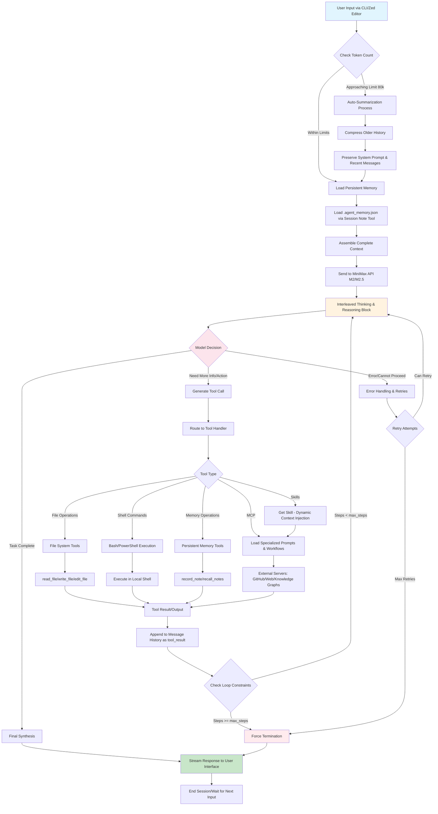
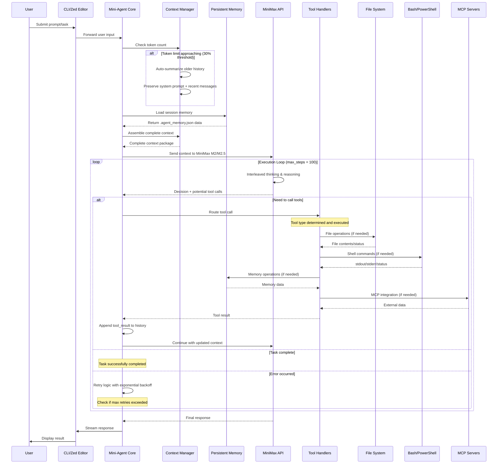
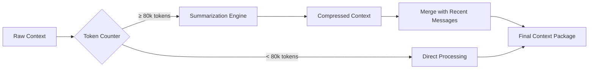
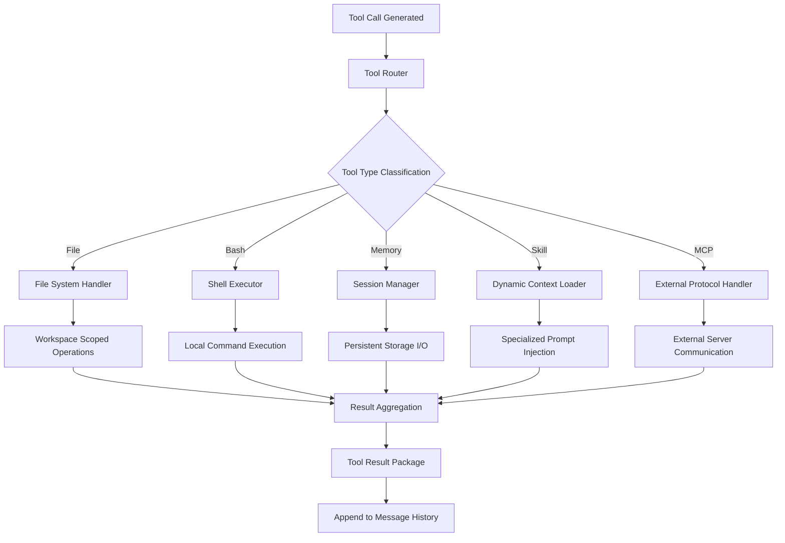
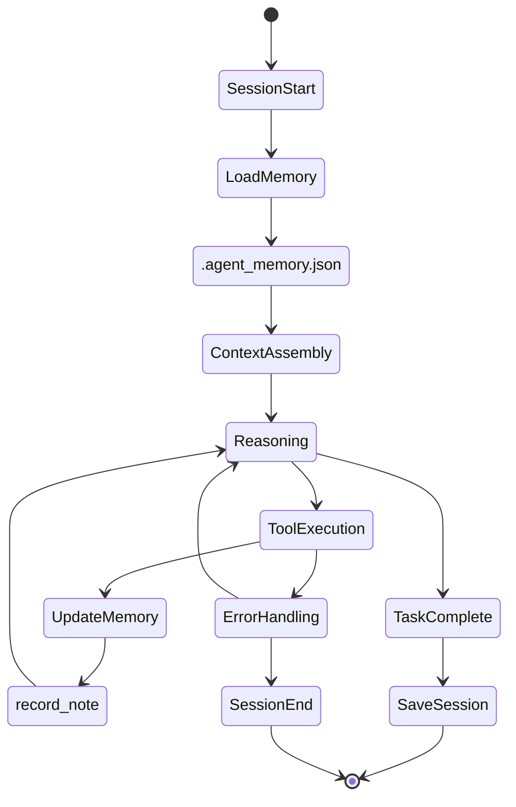
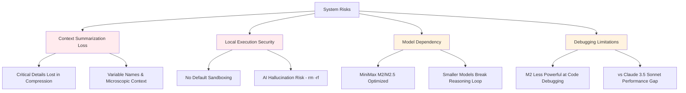

# Mini-Agent System Architecture: Complete Flow Diagram

## System Overview Flowchart

## Detailed Sequence Diagram

## Key System Components Detail

### 1. Context Management System

### 2. Tool Execution Pipeline

### 3. Memory & State Management

## Architecture Bottlenecks & Risk Points

